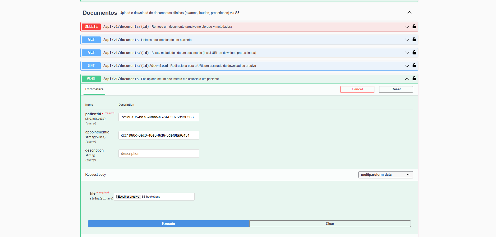
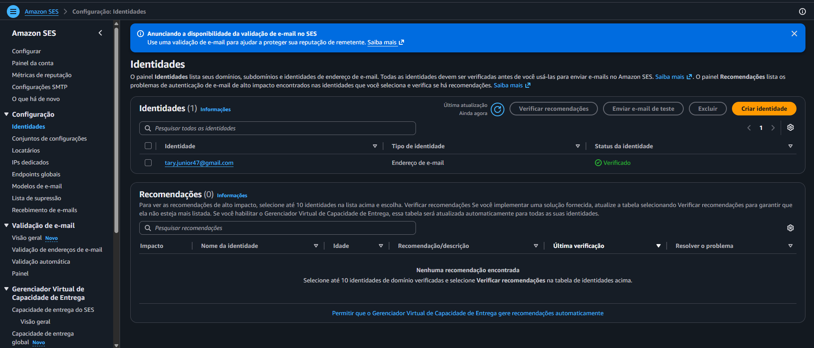
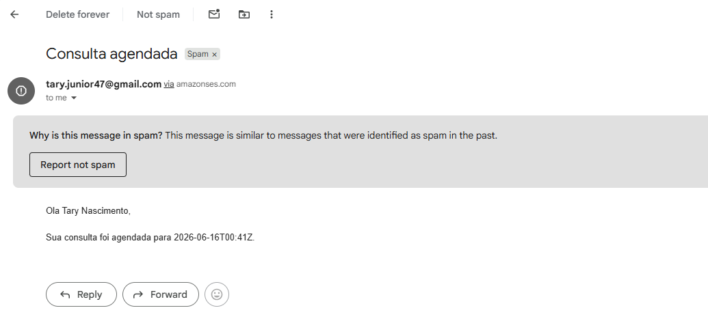
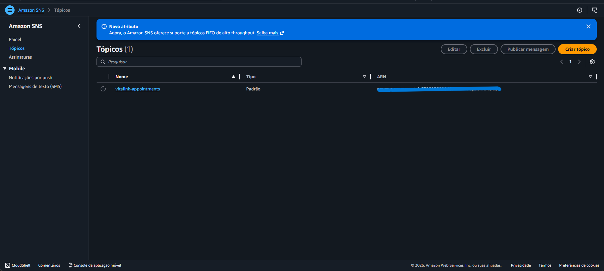
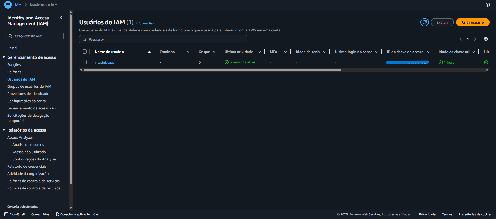

# Plataforma Vitalink

Plataforma unificada de saúde que conecta os principais atores do setor —
**hospitais, clínicas, operadoras e pacientes** — em uma única API REST segura.

O primeiro entregável (este repositório) cobre o núcleo funcional pronto para
produção: **autenticação/autorização (JWT + RBAC)**, **cadastros** (organizações,
profissionais, pacientes e planos de saúde) e **agendamento de consultas** com
regras de negócio reais (sem _overbooking_, máquina de estados de status, etc.).

---

## Sumário

- [Stack](#stack)
- [Arquitetura](#arquitetura)
- [Modelo de domínio](#modelo-de-domínio)
- [Como executar localmente](#como-executar-localmente)
  - [Opção A — Docker Compose (recomendada)](#opção-a--docker-compose-recomendada)
  - [Opção B — Maven + PostgreSQL](#opção-b--maven--postgresql)
- [Variáveis de ambiente](#variáveis-de-ambiente)
- [Fluxo de autenticação](#fluxo-de-autenticação)
- [Endpoints](#endpoints)
- [Integrações AWS](#integrações-aws)
- [Demonstração das integrações AWS](#demonstração-das-integrações-aws)
- [Documentação interativa (Swagger)](#documentação-interativa-swagger)
- [Testes e cobertura](#testes-e-cobertura)
- [Decisões técnicas](#decisões-técnicas)
- [Troubleshooting](#troubleshooting)

---

## Stack

| Camada | Tecnologia |
|---|---|
| Linguagem | **Java 11** |
| Framework | **Spring Boot 2.7.18** (Spring MVC, Spring Security 5.7, Spring Data JPA) |
| Banco de dados | **PostgreSQL 15** |
| Migrations | **Flyway** |
| Autenticação | **JWT** (jjwt 0.11.5), HMAC-SHA512 |
| Documentação | **springdoc-openapi 1.7** (Swagger UI / OpenAPI 3) |
| Build | **Maven** |
| Testes | **JUnit 5**, **Mockito**, **Testcontainers**, **JaCoCo** |
| Nuvem | **AWS SDK for Java v2** (S3, SES, SNS, SQS, Secrets Manager, SSM) |
| Infra | **Docker**, **Docker Compose** |
| Produtividade | **Lombok** |


---

## Arquitetura

Arquitetura **em camadas**, com responsabilidades estritamente separadas
(controllers não contêm regra de negócio):

```
com.vitalink.platform
├── controller/     # Endpoints REST (entrada/saída HTTP, validação, RBAC)
├── service/        # Regras de negócio (interfaces) + impl/ (implementações)
├── repository/     # Spring Data JPA
├── entity/         # Entidades JPA + enums/
├── dto/            # Objetos de transferência (request/response) por contexto
├── mapper/         # Conversão entity <-> DTO
├── security/       # JWT, filtros, UserDetails, configuração de segurança
├── config/         # OpenAPI, auditoria JPA, seed inicial, clientes AWS, beans
├── integration/    # Value objects de integração (EmailMessage, DomainEvent)
├── messaging/      # Consumidor SQS (subscriber dos eventos de domínio)
└── common/         # BaseEntity, Address, exceções e tratamento global
```

Padrões aplicados: **SOLID**, **Clean Code**, **DTO Pattern**, **Repository
Pattern**, **RESTful**, tratamento **global** de exceções, **Bean Validation**,
logs estruturados e **auditoria** automática (createdAt/By, updatedAt/By).

---

## Modelo de domínio

| Entidade | Descrição |
|---|---|
| `User` + `Role` | Identidade de autenticação e perfis (RBAC). Relação N:N. |
| `Organization` | Hospital, Clínica **ou** Operadora (campo discriminador `type`). |
| `HealthcareProfessional` | Profissional vinculado a uma organização (N:1). |
| `Patient` | Paciente (pode ter `User` para acesso ao portal). |
| `InsurancePlan` | Plano ofertado por uma Operadora (`Organization` do tipo `INSURER`). |
| `Appointment` | Consulta — conecta paciente, profissional, organização e (opcional) plano. |

Características transversais (em `BaseEntity`):

- **PK `UUID`** (não-enumerável, segura para exposição em URLs).
- **Auditoria** (`createdAt`/`createdBy`/`updatedAt`/`updatedBy`) via Spring Data JPA.
- **Optimistic locking** (`@Version`) para concorrência.
- **Soft-delete** via campo `status` (preserva histórico).
- Timestamps de auditoria em **UTC** (`Instant` → `timestamptz`).

Regras de negócio relevantes em `AppointmentService`:

- Período válido (fim > início) e no futuro.
- **Sem _overbooking_**: nenhum profissional pode ter duas consultas com horários
  sobrepostos (status `SCHEDULED`/`CONFIRMED`).
- **Máquina de estados** de status: `SCHEDULED → CONFIRMED → COMPLETED`, com
  `CANCELLED`/`NO_SHOW` como estados possíveis (transições inválidas são rejeitadas).
- Atores (paciente, profissional, plano) precisam estar ativos.

---

## Como executar localmente

### Opção A — Docker Compose (recomendada)

Sobe **PostgreSQL + aplicação** com um comando.

```bash
# 1. Crie o arquivo .env a partir do exemplo e ajuste os valores (em especial o segredo JWT)
cp .env.example .env

# 2. Suba tudo
docker compose up --build
```

A API ficará disponível em **http://localhost:8080** e o Swagger em
**http://localhost:8080/swagger-ui.html**.

### Opção B — Maven + PostgreSQL

Pré-requisitos: **JDK 11+** e **Maven 3.8+**. Suba apenas o banco via Docker:

```bash
docker compose up -d db
```

Execute a aplicação com o profile `dev`:

```bash
mvn spring-boot:run -Dspring-boot.run.profiles=dev
```

> O profile `dev` usa, por padrão, `jdbc:postgresql://localhost:5432/medico`
> com usuário/senha `medico`/`medico` (veja `application-dev.yml`).

O **Flyway** cria o schema e os perfis automaticamente na primeira execução.
O **usuário administrador inicial** é criado no _boot_ (e-mail e senha vêm das
variáveis `APP_ADMIN_EMAIL` / `APP_ADMIN_PASSWORD`; padrão
`admin@medico.com` / `ChangeMe@123`).

### Opção C — H2 em memória (sem banco/Docker)

Para subir rapidamente, sem instalar PostgreSQL nem Docker, use o profile `h2`
(banco **em memória**, recriado a cada inicialização):

```bash
mvn spring-boot:run -Dspring-boot.run.profiles=h2
# ou, com o jar já empacotado:
java -jar target/medico-platform.jar --spring.profiles.active=h2
```

- Console web do H2: **http://localhost:8080/h2-console**
  (JDBC URL: `jdbc:h2:mem:vitalink`, usuário `sa`, senha em branco).
- Neste profile o **Flyway é desativado** e o schema é gerado pelo Hibernate
  (`ddl-auto=create-drop`); perfis e admin são criados pelo `DataInitializer`.
- Indicado **apenas para desenvolvimento/testes manuais** — os dados são
  voláteis. Para algo próximo de produção, use PostgreSQL.

### Como escolher o banco

A seleção é feita pelo **profile ativo** (`SPRING_PROFILES_ACTIVE`):

| Profile | Banco | Schema | Quando usar |
|---|---|---|---|
| `dev` (padrão) | PostgreSQL local | Flyway | Desenvolvimento com banco real |
| `prod` | PostgreSQL (env vars) | Flyway | Produção/AWS |
| `h2` | H2 em memória | Hibernate | Subir rápido, sem dependências |

```bash
# Exemplos
SPRING_PROFILES_ACTIVE=h2   java -jar target/medico-platform.jar
SPRING_PROFILES_ACTIVE=dev  java -jar target/medico-platform.jar
```

---

## Variáveis de ambiente

Todas têm valores-padrão para desenvolvimento; em produção, defina-as
explicitamente (veja `.env.example`).

| Variável | Descrição | Padrão (dev) |
|---|---|---|
| `SPRING_PROFILES_ACTIVE` | Profile ativo (`dev`/`prod`) | `dev` |
| `APP_PORT` | Porta HTTP da aplicação | `8080` |
| `SPRING_DATASOURCE_URL` | URL JDBC do PostgreSQL | `jdbc:postgresql://localhost:5432/medico` |
| `SPRING_DATASOURCE_USERNAME` | Usuário do banco | `medico` |
| `SPRING_DATASOURCE_PASSWORD` | Senha do banco | `medico` |
| `POSTGRES_DB` / `POSTGRES_USER` / `POSTGRES_PASSWORD` | Credenciais do container do banco | `medico` |
| `APP_JWT_SECRET` | Segredo (Base64, ≥ 64 bytes) para HMAC-SHA512 | _valor de dev_ |
| `APP_JWT_ACCESS_EXPIRATION_MS` | Validade do _access token_ | `900000` (15 min) |
| `APP_JWT_REFRESH_EXPIRATION_MS` | Validade do _refresh token_ | `604800000` (7 dias) |
| `APP_JWT_ISSUER` | Emissor do token (claim `iss`) | `medico-platform` |
| `APP_ADMIN_EMAIL` | E-mail do admin inicial | `admin@medico.com` |
| `APP_ADMIN_PASSWORD` | Senha do admin inicial | `ChangeMe@123` |
| `APP_CORS_ALLOWED_ORIGINS` | Origens permitidas (CSV) | `http://localhost:3000,http://localhost:8080` |

> **Gerar um segredo JWT forte:** `openssl rand -base64 64`

---

## Fluxo de autenticação

Autenticação **stateless** baseada em JWT (sem sessão/cookie).

```
1. POST /api/v1/auth/register  ou  /api/v1/auth/login
      └─> retorna { accessToken, refreshToken, expiresIn, roles, ... }

2. Requisições autenticadas enviam o header:
      Authorization: Bearer <accessToken>

3. Quando o access token expira (15 min):
      POST /api/v1/auth/refresh  { "refreshToken": "<...>" }
      └─> retorna um novo par de tokens
```

Detalhes de segurança:

- Senhas com **BCrypt** (força 12).
- Tokens assinados com **HMAC-SHA512**; um claim `type` distingue
  _access_ de _refresh_ (um refresh token nunca é aceito como credencial de acesso).
- **RBAC** por perfil: `ROLE_ADMIN`, `ROLE_HOSPITAL`, `ROLE_CLINIC`,
  `ROLE_INSURER`, `ROLE_PROFESSIONAL`, `ROLE_PATIENT`.
- No auto-registro, apenas os perfis `ROLE_PATIENT` e `ROLE_PROFESSIONAL` são
  autoatribuíveis (perfis privilegiados nunca são concedidos via cliente).
- Erros retornam um corpo padronizado (`ApiError`, inspirado no RFC 7807).

### Exemplo rápido (curl)

```bash
# Login como administrador (criado no boot)
TOKEN=$(curl -s -X POST http://localhost:8080/api/v1/auth/login \
  -H 'Content-Type: application/json' \
  -d '{"email":"admin@medico.com","password":"ChangeMe@123"}' | jq -r .accessToken)

# Criar uma organização
curl -X POST http://localhost:8080/api/v1/organizations \
  -H "Authorization: Bearer $TOKEN" \
  -H 'Content-Type: application/json' \
  -d '{"legalName":"Hospital Central LTDA","cnpj":"12345678000190","type":"HOSPITAL"}'
```

---

## Endpoints

Prefixo base: **`/api/v1`**. Todos os endpoints (exceto `auth`, documentação e
health) exigem `Authorization: Bearer <token>`.

### Autenticação — `/api/v1/auth` (público)

| Método | Caminho | Descrição |
|---|---|---|
| `POST` | `/register` | Registra um usuário (paciente/profissional) e retorna tokens |
| `POST` | `/login` | Autentica e emite tokens |
| `POST` | `/refresh` | Renova o access token |

### Usuários — `/api/v1/users`

| Método | Caminho | Perfis | Descrição |
|---|---|---|---|
| `GET` | `/me` | autenticado | Dados do usuário logado |
| `GET` | `/{id}` | ADMIN | Busca por id |
| `GET` | `/` | ADMIN | Lista paginada |

### Organizações — `/api/v1/organizations`

| Método | Caminho | Perfis | Descrição |
|---|---|---|---|
| `POST` | `/` | ADMIN | Cria organização |
| `PUT` | `/{id}` | ADMIN | Atualiza |
| `GET` | `/{id}` | autenticado | Busca por id |
| `GET` | `/?type=HOSPITAL` | autenticado | Lista (filtro opcional por tipo) |
| `DELETE` | `/{id}` | ADMIN | Inativa (soft-delete) |
| `PATCH` | `/{id}/activate` | ADMIN | Reativa |

### Profissionais — `/api/v1/professionals`

| Método | Caminho | Perfis | Descrição |
|---|---|---|---|
| `POST` | `/` | ADMIN, HOSPITAL, CLINIC | Cadastra profissional |
| `PUT` | `/{id}` | ADMIN, HOSPITAL, CLINIC | Atualiza |
| `GET` | `/{id}` | autenticado | Busca por id |
| `GET` | `/?organizationId=...` | autenticado | Lista (filtro opcional por organização) |
| `DELETE` | `/{id}` | ADMIN, HOSPITAL, CLINIC | Inativa |
| `PATCH` | `/{id}/activate` | ADMIN, HOSPITAL, CLINIC | Reativa |

### Pacientes — `/api/v1/patients`

| Método | Caminho | Perfis | Descrição |
|---|---|---|---|
| `POST` | `/` | ADMIN, HOSPITAL, CLINIC, PROFESSIONAL | Cadastra paciente |
| `PUT` | `/{id}` | ADMIN, HOSPITAL, CLINIC, PROFESSIONAL | Atualiza |
| `GET` | `/{id}` | ADMIN, HOSPITAL, CLINIC, PROFESSIONAL | Busca por id |
| `GET` | `/` | ADMIN, HOSPITAL, CLINIC, PROFESSIONAL | Lista paginada |
| `DELETE` | `/{id}` | ADMIN | Inativa |
| `PATCH` | `/{id}/activate` | ADMIN | Reativa |

### Planos de saúde — `/api/v1/insurance-plans`

| Método | Caminho | Perfis | Descrição |
|---|---|---|---|
| `POST` | `/` | ADMIN, INSURER | Cria plano |
| `PUT` | `/{id}` | ADMIN, INSURER | Atualiza |
| `GET` | `/{id}` | autenticado | Busca por id |
| `GET` | `/?operatorId=...` | autenticado | Lista (filtro opcional por operadora) |
| `DELETE` | `/{id}` | ADMIN, INSURER | Inativa |
| `PATCH` | `/{id}/activate` | ADMIN, INSURER | Reativa |

### Consultas — `/api/v1/appointments`

| Método | Caminho | Perfis | Descrição |
|---|---|---|---|
| `POST` | `/` | ADMIN, HOSPITAL, CLINIC, PROFESSIONAL, PATIENT | Agenda consulta |
| `PATCH` | `/{id}/reschedule` | ADMIN, HOSPITAL, CLINIC, PROFESSIONAL, PATIENT | Reagenda |
| `PATCH` | `/{id}/status` | ADMIN, HOSPITAL, CLINIC, PROFESSIONAL | Altera status |
| `GET` | `/{id}` | autenticado | Busca por id |
| `GET` | `/patient/{patientId}` | autenticado | Lista por paciente |
| `GET` | `/professional/{professionalId}` | autenticado | Lista por profissional |

### Documentos — `/api/v1/documents`

Upload e download de documentos clínicos (exames, laudos, prescrições) — armazenados no **S3** (ou em disco local quando a AWS está desabilitada). Veja [Integrações AWS](#integrações-aws).

| Método | Caminho | Perfis | Descrição |
|---|---|---|---|
| `POST` | `/` (`multipart/form-data`) | ADMIN, HOSPITAL, CLINIC, PROFESSIONAL | Faz upload e associa a um paciente |
| `GET` | `/{id}` | autenticado | Metadados + **URL de download pré-assinada** |
| `GET` | `/?patientId=...` | autenticado | Lista documentos de um paciente |
| `GET` | `/{id}/download` | autenticado | Redireciona (302) para a URL pré-assinada |
| `DELETE` | `/{id}` | ADMIN, HOSPITAL, CLINIC | Remove (arquivo no storage + metadados) |

O upload usa _form fields_: `file` (obrigatório), `patientId` (obrigatório),
`appointmentId` e `description` (opcionais).

Paginação: parâmetros `page`, `size` e `sort` em todos os endpoints de listagem.

---

## Integrações AWS

A plataforma integra quatro serviços da AWS, todos opcionais e **desligados por
padrão** (`APP_AWS_ENABLED=false`) — a aplicação sobe normalmente no H2/PostgreSQL
**sem nenhuma credencial**. Quando a AWS está desabilitada, adaptadores locais
substituem cada serviço (gravação em disco temporário e _logs_), permitindo
desenvolver e testar todo o fluxo sem conta na nuvem.

| Serviço AWS | Para quê | Quando `enabled=true` | Quando `enabled=false` (default) |
|---|---|---|---|
| **S3** | Documentos clínicos (exames, laudos, prescrições) | `S3FileStorageService` (upload + URL pré-assinada) | `LocalFileStorageService` (disco temporário) |
| **SES** | E-mails transacionais (agendamento/cancelamento de consulta) | `SesEmailService` | `LogEmailService` (registra em log) |
| **SNS / SQS** | Eventos de domínio (`appointment.scheduled/cancelled/confirmed`) | `SnsEventPublisher` publica; `SqsEventConsumer` consome | `LogEventPublisher` (registra em log) |
| **Secrets Manager / SSM** | Carregar segredos (JWT, senha do banco) no _boot_ | `AwsSecretsEnvironmentPostProcessor` | Usa valores do `.env`/ambiente |

### Desenho (Ports & Adapters)

Cada integração é uma **porta** (interface em `service/`) com dois **adaptadores**
selecionados por configuração via `@ConditionalOnProperty(app.aws.enabled)`:

```
FileStorageService ──┬─ S3FileStorageService     (app.aws.enabled=true)
                     └─ LocalFileStorageService  (default)
EmailService       ──┬─ SesEmailService          (app.aws.enabled=true)
                     └─ LogEmailService          (default)
EventPublisher     ──┬─ SnsEventPublisher        (app.aws.enabled=true)
                     └─ LogEventPublisher        (default)
```

Os clientes do SDK (AWS SDK **v2**) são criados em `config/AwsClientConfig`, também
condicionados a `app.aws.enabled`. As credenciais usam a cadeia padrão da AWS
(_environment_, perfil, **IAM Role**) — ou chaves estáticas se informadas. Os
efeitos colaterais (e-mail/evento) são **não-fatais**: uma falha na AWS é
registrada em log e **não** quebra a operação de negócio principal.

### Fluxo de eventos (SNS → SQS)

Ao agendar, cancelar ou confirmar uma consulta, o `AppointmentService` publica um
evento no **tópico SNS**. Com o _fan-out_ SNS → **fila SQS** configurado, o
`SqsEventConsumer` faz _long polling_ agendado e processa cada mensagem (ponto de
extensão para notificações, projeções, etc.). O consumidor só é ativado com
`APP_AWS_SQS_CONSUMER_ENABLED=true`.

### Habilitando a AWS

1. Crie os recursos na sua conta: **bucket S3**, **identidade verificada no SES**,
   **tópico SNS** e (opcional) **fila SQS** inscrita no tópico.
2. Defina as variáveis no `.env` (veja a tabela abaixo) e `APP_AWS_ENABLED=true`.
3. Em produção, prefira **IAM Role** (deixe `APP_AWS_ACCESS_KEY`/`SECRET_KEY` em
   branco) em vez de chaves estáticas.

| Variável | Descrição | Padrão |
|---|---|---|
| `APP_AWS_ENABLED` | Liga/desliga toda a integração AWS | `false` |
| `APP_AWS_REGION` | Região dos serviços | `us-east-1` |
| `APP_AWS_ACCESS_KEY` / `APP_AWS_SECRET_KEY` | Chaves estáticas (deixe vazio p/ usar IAM Role) | _vazio_ |
| `APP_AWS_S3_BUCKET` | Bucket dos documentos | `vitalink-documents` |
| `APP_AWS_S3_PRESIGN_MINUTES` | Validade da URL pré-assinada (min) | `15` |
| `APP_AWS_SES_FROM` | Remetente verificado no SES | `no-reply@vitalink.com` |
| `APP_AWS_SNS_APPOINTMENT_TOPIC_ARN` | ARN do tópico de eventos de consulta | _vazio_ |
| `APP_AWS_SQS_CONSUMER_ENABLED` | Ativa o consumidor da fila | `false` |
| `APP_AWS_SQS_APPOINTMENT_QUEUE_URL` | URL da fila SQS | _vazio_ |
| `APP_AWS_SECRETS_ENABLED` + `APP_AWS_SECRET_NAME` | Carrega segredo (JSON) do Secrets Manager no boot | `false` |
| `APP_AWS_SSM_ENABLED` + `APP_AWS_SSM_PARAMETER_PATH` | Carrega parâmetros do SSM por _path_ no boot | `false` |
| `APP_MAX_FILE_SIZE` / `APP_MAX_REQUEST_SIZE` | Limites de upload (multipart) | `10MB` / `15MB` |

> **Segredos no boot:** com `APP_AWS_SECRETS_ENABLED=true`, o
> `AwsSecretsEnvironmentPostProcessor` lê um segredo JSON (ex.: `{"APP_JWT_SECRET":
> "...","SPRING_DATASOURCE_PASSWORD":"..."}`) **antes** de o contexto subir e o
> expõe como _property source_ de alta prioridade — assim nada sensível precisa
> ficar no `.env` em produção. Qualquer falha é tolerada (cai nos defaults locais).

---

## Demonstração das integrações AWS

> Evidências capturadas com a aplicação rodando conectada à **AWS real** (Free Tier,
> região `us-east-1`). Recursos provisionados via [`scripts/aws/setup-aws.sh`](scripts/aws/setup-aws.sh).

### S3 — Documentos clínicos
Upload via `POST /api/v1/documents` (multipart). O arquivo é gravado no bucket
privado e o download acontece por **URL pré-assinada** (presigned URL), sem expor o
bucket publicamente.




### SES — E-mail transacional
Ao agendar uma consulta, o paciente recebe um e-mail de confirmação (remetente
verificado no SES).




### SNS + SQS — Eventos de domínio
O agendamento publica um evento no tópico **SNS**, que faz _fan-out_ para uma fila
**SQS** consumida pela aplicação (`SqsEventConsumer`). Eventos:
`appointment.scheduled` / `appointment.confirmed` / `appointment.cancelled`.



Trecho dos logs mostrando o fluxo ponta a ponta (publicação no SNS + consumo no SQS):

```text
INFO  c.v.p.service.impl.SnsEventPublisher  - Evento publicado no SNS: type=appointment.scheduled, topic=arn:aws:sns:us-east-1:***:vitalink-appointments
INFO  c.v.p.messaging.SqsEventConsumer      - Evento recebido da fila SQS: id=..., body={"appointmentId":"...","status":"SCHEDULED"}
```

### Segurança — IAM least-privilege
A aplicação usa um usuário IAM dedicado, com política de **menor privilégio**
(apenas as ações de S3/SES/SNS/SQS/SSM efetivamente utilizadas).



---

## Documentação interativa (Swagger)

Com a aplicação no ar:

- **Swagger UI:** http://localhost:8080/swagger-ui.html
- **OpenAPI JSON:** http://localhost:8080/v3/api-docs

Clique em **Authorize** e informe o _access token_ (`Bearer`) para testar os
endpoints protegidos diretamente pela interface.

---

## Testes e cobertura

```bash
# Testes unitários (Mockito) — rápidos, sem dependências externas
mvn test

# Suíte completa (unitários + integração com Testcontainers) + relatório/gate de cobertura
mvn verify
```

- **99 testes** (unitários + integração), incluindo os adaptadores AWS
  (clientes do SDK mockados via Mockito — não exigem AWS nem LocalStack).
- Os testes de **integração** sobem um **PostgreSQL real via Testcontainers**
  (paridade com produção; o Flyway roda as migrations no container) — exigem
  **Docker** em execução.
- **Cobertura via JaCoCo** com _gate_ mínimo de **80%** de instruções, validado
  na fase `verify`. Relatório HTML em `target/site/jacoco/index.html`.
  (Boilerplate gerado pelo Lombok — DTOs, entidades — é excluído da medição.)

---

## Decisões técnicas

- **UUID como chave primária** — evita enumeração de recursos e facilita
  ambientes distribuídos.
- **Flyway em vez de `ddl-auto`** — o schema é versionado e auditável;
  `hibernate.ddl-auto=validate` apenas confere a aderência ao mapeamento.
- **Organização em tabela única com discriminador `type`** — hospital, clínica e
  operadora compartilham os mesmos atributos; mais simples e performático que
  herança JPA.
- **`Instant` (UTC) nos campos de auditoria** — universalmente suportado pela
  auditoria do Spring Data e mapeado para `timestamptz` (evita ambiguidades de
  fuso). Os horários de agenda usam `OffsetDateTime`.
- **Soft-delete** — registros são inativados (status), preservando histórico
  clínico/administrativo.
- **Validação anti-conflito de agenda** no serviço + índices apropriados.
  _Hardening_ recomendado para produção: uma constraint de exclusão
  (`btree_gist`) no PostgreSQL para garantir a ausência de _overbooking_ também
  no nível do banco.
- **Conformidade LGPD** — dados sensíveis (CPF, dados de saúde) sob RBAC estrito
  e nunca registrados em logs.

---

## Troubleshooting

**Testcontainers: "Could not find a valid Docker environment" (Windows + Docker Desktop muito recente).**
Em algumas instalações recentes do Docker Desktop no Windows, a biblioteca cliente
negocia uma versão de API antiga via _named pipe_ e falha. Solução ao rodar os
testes:

```bash
export DOCKER_HOST='npipe:////./pipe/docker_engine_linux'
mvn -Dapi.version=1.44 verify
```

Em Linux/CI com socket Unix padrão, nada disso é necessário. **Não** fixe esses
valores no `pom.xml` (quebraria outros ambientes).

**Flyway falha por schema pré-existente divergente.** Em desenvolvimento, recrie
o volume do banco: `docker compose down -v && docker compose up --build`.
